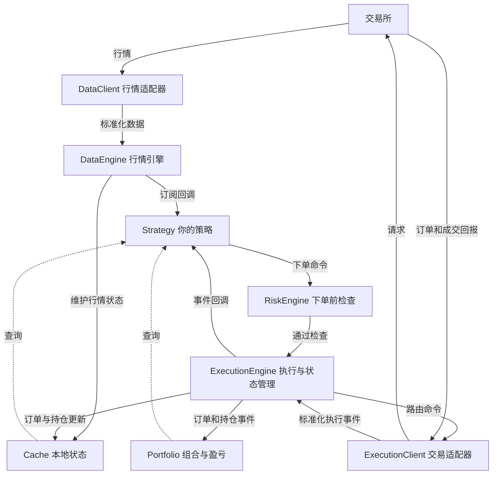

# 01｜从零看懂 NautilusTrader：一条行情怎样走完整个交易系统

> 版本更新：本篇保留第一篇写作时的 v1 核验记录。2026-09-04 后续核验已确认本地安装 `2.0.0rc4`；当前 API、回调名称和阅读入口请看 [第二篇](E:/Nautilus-Perps/学习课题/NautilusTrader框架入门/02.md)。下文 v1 源码链接可能因安装包替换而失效。

## 这一篇要解决的问题

建立一张可以放进脑中的系统地图：有哪些模块，它们怎么连接，谁驱动谁，以及代码在哪里。用跨所永续价差作为贯穿例子，把概念放进具体流程中理解。

本篇依据 2026-09-04 核验的本地 `nautilus_trader==1.231.0` 源码，并对照官方当前概念文档。当前官方文档大量采用 v2；本篇会明确区分。示意中的价格、数量和状态均为教学假设，不是行情或交易建议。

用户随后说明 `2.0.0rc4` 可能只是下载 wheel 到临时目录，安装状态待向 CC 核实。本篇不把这个下载记录视为安装成功；先学习共通架构，运行示例时再统一版本。

## 正文

### 一、先分清三个东西

**NautilusTrader** 是通用的程序化交易框架：处理行情、订单、账户、持仓、风控、回测和实盘运行等公共问题。

**Nautilus-Perps** 是你基于这个框架建立的项目。它的目标是验证跨所永续价差的实际执行效果。

**交易所适配器** 是框架和具体交易所之间的连接层。例如 Hyperliquid 适配器把交易所自己的行情和成交消息翻译成框架统一的对象，也把框架下单命令转换成交易所请求。

你今后的工作主要有两类：编写“什么时候交易、失败时怎么办”的策略；当交易所尚未接入时，开发它的适配器。通用框架承担共同的运行和状态管理工作。

学习框架时还要分清两种图：

- 源码依赖图回答“这个模块调用、引用了哪个模块”。
- 运行流程图回答“一条消息经过哪些模块”。

代码写在同一个模块里，不代表所有工作都发生在同一个时刻；模块分开，也不代表它们各自占用一个进程。

### 二、先记住三个流向

下图展示普通、非本地模拟订单的简化逻辑流。箭头表示消息方向；消息总线、异步队列和具体函数调用共同承载这些连接，图中没有把每一次内部调用单独画出来。



第一条是**行情流**：交易所 → 行情客户端 → 行情引擎 → 策略。

第二条是**命令流**：策略 → 风控 → 执行引擎 → 交易客户端 → 交易所。

第三条是**回报流**：交易所 → 交易客户端 → 执行引擎 → 订单、持仓、组合和策略。

第一遍先记住这三条线，后面遇到任何功能，都试着把它放回其中一条线。

### 三、各个模块具体负责什么？

#### 1. Model：交易系统共同使用的词汇

不同交易所对同一类信息使用不同字段。框架用统一对象承接这些信息。

- `Instrument`：一个可交易合约或证券的定义，包括交易场所、币种、价格和数量精度、最小数量、乘数等。
- `InstrumentId`：框架中识别交易品种的 ID，必须区分不同场所和不同合约。
- `Price`、`Quantity`、`Money`：分别表达价格、数量、带币种的金额。
- `QuoteTick`：一条报价，通常含最优买卖价及数量。
- `TradeTick`：市场上一笔成交信息，不专指你自己的成交。
- `Bar`：一段时间或一定交易活动聚合形成的数据，常见的是 OHLCV K 线。
- `Order`：你向交易所表达的交易意图及其后续状态。
- `Position`：成交累积产生的持仓。

例如两家交易所都有“NVDA 永续”，它们仍然是两个独立的 Instrument。合约乘数、结算币、交易时间、指数规则和交易状态需要核对。统一对象使代码可共用；经济条款仍保留在品种定义里。

#### 2. Adapter：交易所的翻译与连接层

一个完整适配器通常包含：

- 合约加载与符号映射。
- HTTP 客户端，用于查询、账户快照及部分交易请求。
- WebSocket 客户端，用于连续接收行情和账户事件；部分场所也支持通过它下单。
- 鉴权、签名、时间戳或 nonce 管理。
- 行情和账户消息的解析。
- 连接、心跳、重订阅、限流和失败处理。
- `DataClient` 与 `ExecutionClient`，分别对接框架的数据与执行接口。
- 配置与 Factory。Factory 根据配置创建具体客户端，再交给节点注册使用。

只配置 DataClient 就可以做行情观察。ExecutionClient 涉及账户和订单，应该在需要交易的阶段单独接入。

一个场所有行情支持，不自动代表同版本具有完整交易支持。具体数据、订单类型、账户模式和历史查询能力要看该适配器的能力矩阵。[官方适配器概念](https://nautilustrader.io/docs/latest/concepts/adapters/)

#### 3. DataEngine：统一管理行情请求和分发

策略可以向它提出两种需求：

- “从现在开始，把这个合约的新行情持续给我”——订阅。
- “把过去一段时间的数据给我”——历史请求。

DataEngine 管理请求路由、订阅、部分数据聚合，以及向感兴趣的组件分发数据。标准对象的交易所解析通常由适配器完成。

订单簿状态还涉及快照、增量及受管理的订单簿更新。订阅到深度增量，并不自动证明已获得连续、可用的完整本地盘口。具体维护路径依版本和订阅模式而定。

#### 4. Strategy：你的决策逻辑

策略通常写这些内容：

- 启动时关注哪些品种、订阅哪些数据。
- 收到数据后如何计算信号。
- 什么时候提交或取消订单。
- 收到部分成交、拒绝或超时结果后如何处理。
- 什么时候停止开新仓、退出和停机。

本地 v1 的 `Strategy` 继承 `Actor`。Actor 提供接收数据、时间事件和生命周期等公共能力；Strategy 在这些基础上增加订单与持仓操作。v2 的 Python 公共接口还会见到 `DataActor`。这里的 Actor 是程序组件概念，与 AI agent 无关。[Actor 概念](https://nautilustrader.io/docs/latest/concepts/actors/)

#### 5. RiskEngine：下单前的公共检查

它按配置和订单类型进行检查，例如价格数量是否合法、名义金额是否超过限制、下单速率、账户相关约束，以及当前交易状态是否允许该动作。

这些公共检查与策略级约束共同工作。你的项目还需要定义双腿最大不平衡、行情陈旧时的行为、异常后能否继续开仓等专用规则。

风控检查只能根据当时已经掌握的数据作出判断。检查通过后，价格、账户和交易所状态还可能继续变化。

#### 6. ExecutionEngine：路由命令并管理交易状态

执行引擎收到下单命令后，寻找相应客户端，再把命令交给它。订单响应与成交事件回来后，执行引擎处理订单状态、成交与持仓等变化。

它需要回答：这个事件属于哪个订单？该订单属于哪个策略和账户？是否已有这笔成交？当前状态允许应用这个事件吗？

下单成功收到受理回报，代表交易所接受了订单；具体成交还需要成交证据。

#### 7. Cache：程序当前掌握的本地状态

Cache 让策略快速查询已经载入的合约、最近行情、订单、持仓和账户。

例如策略需要“另一家交易所最新买价”时，通常读本地 Cache 或策略维护的行情状态，避免每次信号计算都发 HTTP 查询。

Cache 的内容受消息到达和处理速度影响，断线或漏报时可能与交易所有差异。内存 Cache、用于重启恢复的持久化状态、长期历史数据存储各有用途。配置数据库后也不能假定所有运行状态都能自动恢复。[Cache 文档](https://nautilustrader.io/docs/latest/concepts/cache/)

#### 8. Portfolio 与 Accounting：把成交变成账户和组合视角

订单状态回答“这笔委托进行到哪里”；组合模块回答“当前持有什么、敞口多少、盈亏如何”。

需要区分：

- 已实现盈亏：已关闭交易产生的盈亏。
- 未实现盈亏：未平仓头寸按选定估值价格计算的浮动结果。
- 手续费和资金费：独立的经济项目，正确记录依赖数据、币种和模型支持。
- 保证金和余额：账户能否承受仓位和订单的约束。

估值价格、汇率、费用数据不完整时，组合结果也有相应边界。两家方向相反的仓位仍分别存在于各自账户中，资金和保证金不会因逻辑对冲而自动共享。[Portfolio 文档](https://nautilustrader.io/docs/latest/concepts/portfolio/)

#### 9. MessageBus：模块间传递消息

它支持三类常见连接：

- 发布／订阅：一条行情可以交给多个订阅者。
- 点对点：一个下单命令送到负责处理它的执行入口。
- 请求／响应：历史查询带着关联关系返回结果。

最小系统可以在一个进程里完成这些工作。进程内部的消息总线与外部 Redis 等服务是不同层次；使用消息总线本身不要求搭建消息中间件。[MessageBus 文档](https://nautilustrader.io/docs/latest/concepts/message_bus/)

#### 10. Node、Kernel、Trader：把部件装配并运行起来

- `TradingNode`：本地 v1 的实盘运行入口。v2 常见名称为 `LiveNode`。
- `NautilusKernel`：构建、持有并协调核心部件和共享服务。
- `Trader`：管理策略、Actor 和执行算法等组件。

启动大体经历配置、创建客户端、连接、加载合约和账户、必要的恢复／对账、启动策略，然后持续处理事件。停止时还涉及停止策略、处理未完成任务、断开连接和释放资源。退出过程需要按项目规则设计；不能把进程退出当成账户已平仓。

### 四、框架究竟由什么驱动？

它采用事件驱动：行情到达、订单回报到达、时间到达，触发相应处理。

回调函数的含义是：你事先提供“收到这种消息时做什么”的函数，框架在对应时机调用它。

本地 v1 常见回调：

| 回调 | 触发场景 |
|---|---|
| `on_start()` | 策略开始运行 |
| `on_quote_tick(tick)` | 收到已订阅品种的报价 |
| `on_trade_tick(tick)` | 收到市场成交 |
| `on_order_book_deltas(deltas)` | 收到盘口增量 |
| `on_bar(bar)` | 收到 K 线 |
| `on_order_filled(event)` | 收到属于策略的成交事件 |
| `on_order_rejected(event)` | 收到订单拒绝事件 |
| `on_stop()` | 策略停止流程调用 |

下面是教学伪代码：省略了构造、配置、类型、错误处理和完整风险检查，不能直接运行。

```python
class SpreadStrategy(Strategy):
    def on_start(self):
        self.subscribe_quote_ticks(self.venue_a_instrument)
        self.subscribe_quote_ticks(self.venue_b_instrument)

    def on_quote_tick(self, tick):
        self.update_latest_quote(tick)
        if not self.both_venues_ready_and_fresh():
            return
        if self.has_unresolved_orders():
            return
        self.evaluate_spread()

    def on_order_filled(self, event):
        self.update_pair_state(event)
        self.evaluate_unhedged_exposure()

    def on_order_rejected(self, event):
        self.handle_pair_failure(event)
```

这体现“控制反转”：你的代码把函数交给框架，框架控制何时调用。程序运行时，框架持续等待和处理消息。

本地源码中可以直接看到两个循环：

- `live/data_engine.py` 的 `_run_data_queue()` 等待行情队列，然后调用数据处理逻辑。
- `live/execution_engine.py` 的 `_run_evt_queue()` 等待订单事件队列，然后处理执行事件。

`live/node.py` 的 `run_async()` 启动 Kernel 后，用 `asyncio.gather()` 等待行情、风控和执行引擎的队列任务。

`await queue.get()` 的直观含义是“等下一条消息，等待期间让其他异步任务获得运行机会”。异步适合同时等待网络、消息和定时器；同一事件循环里的 CPU 密集计算仍会占住执行时间。因此行情回调应尽量短，避免长时间计算、阻塞网络调用或等待人工输入。

v2 的实现进一步使用 Rust 的节点调度、通道和 Tokio 网络任务；交易核心在节点线程分发消息。异步 I/O、核心事件处理和后台服务应分开理解。具体线程拓扑依版本，不能把每个模块想成独立服务器。[架构与线程模型](https://nautilustrader.io/docs/latest/concepts/architecture/)

### 五、沿着一笔跨所交易走一遍

假设已经核对两家合约条款，教学上使用相同单位：

- A 的卖一价为 100.00。
- B 的买一价为 100.20。
- 策略考虑买 A、卖 B。

这只是某一方向的入场毛价差示意；还没有扣除费用、深度、延迟、后续退出和两腿失败风险。

1. A 的行情客户端收到价格更新，转换为标准行情对象。
2. 行情引擎处理并分发，策略报价回调被调用。
3. 策略读取 B 的最新状态，同时检查两家行情年龄、数量和是否仍有未决订单。
4. 策略按合约精度创建两笔独立订单，发出下单命令。
5. 风控检查每笔订单，执行引擎把它们路由到各自交易客户端。
6. 两家交易所独立处理请求，受理与成交回报异步返回。
7. 执行引擎应用事件，更新订单、持仓，相关事件驱动组合和策略处理。
8. 策略将两笔订单的成交数量关联起来，判断组合是否达到目标；出现不平衡时执行事先定义的恢复规则。

这里有两套状态：框架负责单笔订单的状态；你的策略负责跨所组合状态，例如 `WAITING → OPENING → HEDGED → CLOSING → FLAT`。这些组合状态名是教学设计，不是框架自带枚举。

两笔订单可以几乎同时发送，但交易所各自决定成交。A 成交 1 份、B 成交 0.4 份时，在合约单位可比较的前提下，仍有 0.6 份未对冲数量。是否补另一腿、平掉已成腿或停机，需要策略规则和授权边界。

### 六、最重要的概念，按使用场景认识

#### 数据、命令、事件

- 数据：观察到的信息，例如买一价、卖一价、市场成交。
- 命令：希望系统执行的动作，例如提交、修改、取消订单。
- 事件：已经观察到的状态变化，例如订单被接受、成交或撤销。

命令可以被拒绝。网络超时只说明某一层等待结束，订单的实际结果仍可能未知。查单、成交回报及对账用于补齐证据。

#### 订单、成交、持仓

假设发送买入 10 份的订单，后来分两次成交 3 份和 2 份：

- 订单数为 1。
- 成交记录为 2。
- 已成交数量为 5。
- 若原来空仓，且没有其他交易，持仓增加 5。

再把剩余数量成功撤销后，订单可以结束为 `CANCELED`，已成交的 5 份仍然保留。订单结束与仓位关闭是两件事。

#### 状态机

状态机用“当前状态、发生的事件、允许的新状态”约束变化。常见正常路径可简写成：初始化 → 已提交 → 已接受 → 部分成交 → 全部成交。实际存在拒绝、撤销、过期、修改中等分支，消息到达顺序还可能需要恢复处理。

它帮助系统避免把相互矛盾的回报直接覆盖到一个简单的成功／失败标记上。

#### L1、L2、L3 与本地盘口

- L1：最优买卖报价。
- L2：按价格档位汇总的数量，也称 MBP。
- L3：逐订单级信息，也称 MBO。

框架具有相应数据结构，实际能获得哪一层取决于交易所和数据源。

快照给出某一时刻的盘口；增量描述随后发生的变化。需要按场所协议处理序号、重连和缺口。只看最优价可以判断方向，评估较大数量的可成交价格还需要多档深度。[订单簿概念](https://nautilustrader.io/docs/latest/concepts/order_book/)

#### 精度、步长与名义金额

价格步长限制允许报价，数量步长限制允许下单量。显示小数位数与实际步长约束也要区分。名义金额还取决于合约乘数和线性／反向合约定义。

`Price`、`Quantity` 和 `Money` 帮助保留类型、精度及币种；下单时仍应依据 Instrument 的规则构造和验证。不要把所有价格和数量当成可随意四舍五入的普通浮点数。[值类型](https://nautilustrader.io/docs/latest/concepts/value_types/)

#### IOC、GTC、Post-only、Reduce-only

- IOC：立即尝试成交，可部分成交；剩余部分取消。
- GTC：通常持续有效，直至成交、撤销或场所规则终止。
- Post-only：希望订单只作为挂单进入盘口；立即会吃单时如何处理由场所规则决定。
- Reduce-only：限制订单用于减小已有仓位；具体支持受账户模式和交易所规则约束。

它们是不同维度的订单约束。把条件组合起来时，需要适配器与交易所共同支持。[执行概念](https://nautilustrader.io/docs/latest/concepts/execution/)

#### 事件时间、接收时间与陈旧数据

数据对象通常包含 `ts_event` 和 `ts_init`：前者表达事件来源时间，后者表达对象在接入处理时初始化的时间，通常使用纳秒表示。两者差值会受到来源时钟偏移、时间戳语义和处理延迟影响，不能自动当成纯网络延迟。

比较两个场所时，应分别检查各自数据年龄和连接状态。把当前 A 报价与旧 B 报价相减，可能产生已经无法成交的价差。

#### 对账与事件溯源

事件溯源强调保留并应用状态变化，从事件理解订单和持仓如何走到当前状态。它不等于默认自动保存全部数据；持久化和历史覆盖需要配置。

对账则用交易所订单、成交、持仓报告核对本地状态，补充漏掉的变化。恢复依赖场所返回的历史和已保存信息，无法保证凭空重建缺失的成交经济细节。对账过程中生成的合成记录应与真实成交证据区分。[事件溯源](https://nautilustrader.io/docs/latest/concepts/event_sourcing/)、[执行对账](https://nautilustrader.io/docs/latest/concepts/reconciliation/)

### 七、回测、Paper、Testnet、实盘如何关联？

| 环境 | 行情来源 | 谁决定成交 | 能检验什么 |
|---|---|---|---|
| 回测 | 历史数据 | 本地模拟交易所／成交模型 | 策略历史行为、事件处理和模型假设下的结果 |
| Paper／本地 Sandbox | 通常为实时行情 | 本地模拟器 | 实时信号、程序运行和模拟执行 |
| Testnet | 交易所测试环境 | 测试环境交易系统 | 签名、协议、订单与回报链路 |
| Mainnet | 主网行情 | 真实交易所 | 实际成交、费用、流动性和运行风险 |

Nautilus 让这些场景复用大量数据模型、策略和核心组件。变化集中在数据来源、时钟和执行端。

回测可以让模拟时钟快速推进：历史事件之间相隔 1 分钟，回放无需在现实中等待 1 分钟。实盘使用真实时间，网络与交易所带来不可控延迟。

回测的可信度受输入颗粒度和成交模型约束。1 分钟 K 线无法完整提供分钟内的盘口变化、排队次序和两家交易所的异步先后顺序。费用、滑点、延迟、资金费和市场冲击需要分别审视。[回测概念](https://nautilustrader.io/docs/latest/concepts/backtesting/)

### 八、源码应该从哪里读？

本地安装根目录是 `E:\Nautilus-Perps\.venv\Lib\site-packages\nautilus_trader`。下面的链接均已核对存在，是阅读入口；业务代码应写在自己的项目中。

| 学习内容 | 当前本地 v1 源码入口 | 先看什么 |
|---|---|---|
| 一个完整策略例子 | [ema_cross.py](/E:/Nautilus-Perps/.venv/Lib/site-packages/nautilus_trader/examples/strategies/ema_cross.py:96) | 配置、`on_start`、`on_bar`、提交订单 |
| 节点怎么运行 | [live/node.py](/E:/Nautilus-Perps/.venv/Lib/site-packages/nautilus_trader/live/node.py:272) | `build`、`run_async` |
| 核心部件怎么装配 | [system/kernel.py](/E:/Nautilus-Perps/.venv/Lib/site-packages/nautilus_trader/system/kernel.py:101) | 引擎和共享服务的创建、生命周期 |
| 策略公共接口 | [trading/strategy.pyx](/E:/Nautilus-Perps/.venv/Lib/site-packages/nautilus_trader/trading/strategy.pyx:109) | `submit_order` 和订单事件处理 |
| 行情队列 | [live/data_engine.py](/E:/Nautilus-Perps/.venv/Lib/site-packages/nautilus_trader/live/data_engine.py:477) | `_run_data_queue` |
| 行情引擎 | [data/engine.pyx](/E:/Nautilus-Perps/.venv/Lib/site-packages/nautilus_trader/data/engine.pyx:171) | 数据类型处理、订阅与分发 |
| 风控 | [risk/engine.pyx](/E:/Nautilus-Perps/.venv/Lib/site-packages/nautilus_trader/risk/engine.pyx:76) | 检查、拒绝和命令转发 |
| 执行状态 | [execution/engine.pyx](/E:/Nautilus-Perps/.venv/Lib/site-packages/nautilus_trader/execution/engine.pyx:1245) | `_handle_event` |
| 执行异步入口 | [live/execution_engine.py](/E:/Nautilus-Perps/.venv/Lib/site-packages/nautilus_trader/live/execution_engine.py:511) | `_run_evt_queue` 和对账 |
| 消息总线和时钟 | [common/component.pyx](/E:/Nautilus-Perps/.venv/Lib/site-packages/nautilus_trader/common/component.pyx:2228) | `MessageBus`；同文件有 `Clock` |
| 本地状态 | [cache/cache.pyx](/E:/Nautilus-Perps/.venv/Lib/site-packages/nautilus_trader/cache/cache.pyx) | 订单、持仓、行情查询 |
| 组合 | [portfolio/portfolio.pyx](/E:/Nautilus-Perps/.venv/Lib/site-packages/nautilus_trader/portfolio/portfolio.pyx) | 盈亏与敞口 |
| 历史数据 | [persistence/catalog/parquet.py](/E:/Nautilus-Perps/.venv/Lib/site-packages/nautilus_trader/persistence/catalog/parquet.py) | ParquetDataCatalog |
| 回测驱动 | [backtest/engine.pyx](/E:/Nautilus-Perps/.venv/Lib/site-packages/nautilus_trader/backtest/engine.pyx:217) | BacktestEngine、SimulatedExchange |
| 场所接入 | [Hyperliquid data.py](/E:/Nautilus-Perps/.venv/Lib/site-packages/nautilus_trader/adapters/hyperliquid/data.py) / [execution.py](/E:/Nautilus-Perps/.venv/Lib/site-packages/nautilus_trader/adapters/hyperliquid/execution.py) | 把场所消息和框架对象互相转换 |

官方 EMA 示例明确标注没有已验证的盈利优势，不用于真实资金交易。我们用它学习程序结构。

文件后缀也可以帮助定位：

- `.py`：Python 源码。
- `.pyx`：Cython 源码，通常编译后执行。
- `.pxd`：Cython 声明文件。
- `.pyd`：Windows 下编译好的 Python 扩展模块。
- `.rs`：Rust 源码。
- `.pyi`：Python 类型签名／接口声明，通常不包含实际执行逻辑。

v2 官方仓库的主要实现按 `crates/` 中的 Rust crate 划分：`model`、`common`、`data`、`execution`、`risk`、`portfolio`、`trading`、`system`、`live`、`backtest`、`adapters` 等。crate 可以理解为 Rust 的代码包／编译单元，公共依赖和可选能力在 `Cargo.toml` 中配置。PyO3 将 Rust 能力暴露给 Python，`.pyi` 帮助编辑器理解接口。

最先读 EMA 示例和节点入口，然后沿一个函数追踪。跨所策略暂时不涉及的期权、序列化格式、数据库实现，可以以后再学。

### 九、功能全景与项目边界

按职责还可以找到以下功能组：

- `indicators`：技术指标计算。指标给出数值，交易策略决定如何使用。
- `analysis` 和报告：交易结果、绩效统计与报告工具。
- `persistence`：数据目录、历史数据存取等持久化能力。
- `serialization`：把对象编码为便于保存或传输的格式，以及反向解析。
- `network` 与签名相关模块：连接、传输、重试及密码学工具。
- 执行算法：将大订单按规则拆分或安排执行；是否可用取决于实现与配置。
- 本地订单模拟与触发：由本地程序维护部分订单逻辑；场所原生条件单则由场所维护。程序断开时，两者的行为边界不同。
- 测试工具：数据和执行测试器、模拟账户、固定测试数据。

框架支持多资产和多场所的统一工作方式；每个适配器覆盖的品种、环境与订单能力不同。

你仍要实现或确认：合约可比性、价差计算、执行规模、费用与资金费口径、两腿状态、异常恢复、敞口限制、停机规则、监控告警，以及实际经济效果。

以 Aster 为例：新增适配器应优先补齐合约加载、数据订阅、签名、下撤单、账户回报、重连与对账接口。策略的价差信号不应该写进 Aster HTTP 客户端；交易所的签名细节也不应该散落在策略回调里。职责清楚以后，多场所复用才比较容易维护。

### 十、v1 与 v2：学习时怎么避免混用？

| 项目 | 本地 v1 `1.231.0` | 当前 v2 接口方向 |
|---|---|---|
| 实盘入口 | `TradingNode` | `LiveNode` |
| 报价回调 | `on_quote_tick` | `on_quote` |
| 盘口增量回调 | `on_order_book_deltas` | `on_book_deltas` |
| 实现形态 | Python／Cython 与 Rust 混合 | Rust 核心 + PyO3 Python 接口 |

职责和事件闭环可以共同理解，导入路径、构造参数、生命周期和回调名称需要按版本核实。当前版本的 `.venv` 不会因阅读新文档就变成 v2。

本篇只验证了已安装版本与所列源码入口，没有启动行情节点、验证账户、下单或修改依赖。[版本迁移说明](https://github.com/nautechsystems/nautilus_trader/releases/tag/v1.231.0)、[当前策略回调文档](https://nautilustrader.io/docs/latest/concepts/strategies/)

## 小结

1. 用行情流、命令流、回报流理解模块连接。
2. 策略通过回调响应事件；节点、事件循环、消息队列与总线负责驱动和传递。
3. 单笔订单状态与跨所组合状态分层管理；交易所账户仍各自独立。
4. 回测和实盘复用公共组件，输入、时间、成交和恢复条件各有区别。
5. 先从实际安装版本的一份示例追踪调用，遇到 v2 资料时核对名称和接口。

### 合上文章，试着回答

1. 收到“订单已接受”后，为什么还需要等待成交事件？
2. A 已成交、B 拒绝时，哪些是框架负责的，哪些要由你的策略负责？
3. 交易所刚推送的新行情，怎样最终让 `on_quote_tick()` 被调用？

这些问题用于发现下一篇该补充的地方，不表示当前已经掌握。

## 下一篇预告

暂定：逐段读一份最小只读策略，从配置、构造、注册、订阅到第一条行情回调，不进行交易。若反馈显示消息队列或订单概念仍抽象，就先用更小的例子讲清它们。

---

## 学习反馈

你可以写：

1. 哪里看懂了？
2. 哪里没看懂？
3. 哪个地方想展开？
4. 这个主题和你的真实问题有什么关系？

请写在这行下面：

2026-09-04，用户在对话中的实际反馈：

> 1. 所以具体策略是写在策略回调里面的？2 以你的最后的实例来说 我来问问题 A交易所获得报价触发回调 然后再去读取B？3. 费用/深度这些考虑写在哪里？ 4. 大部分交易所只提供L2？ L3很少吧？ 5.我已经让CC用rc4了 如果要度对应的代码 给我一个rc4的列表
